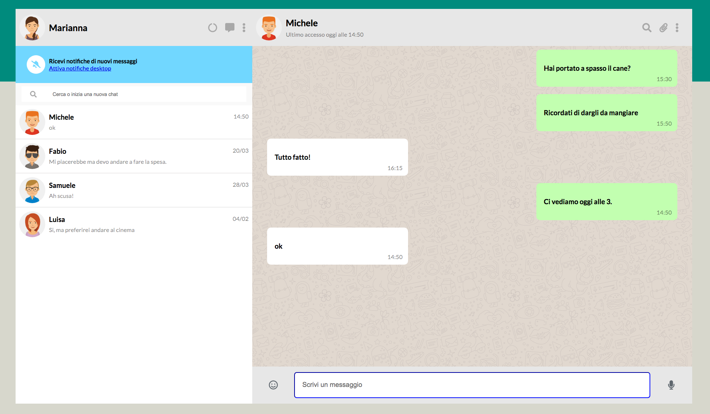
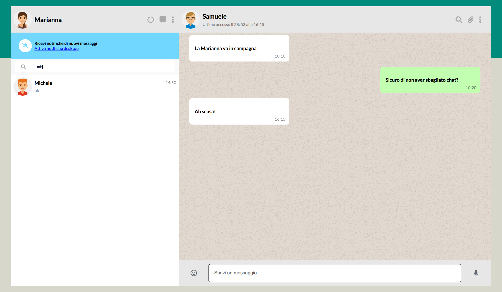
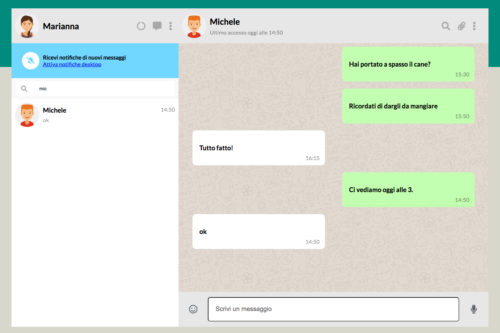
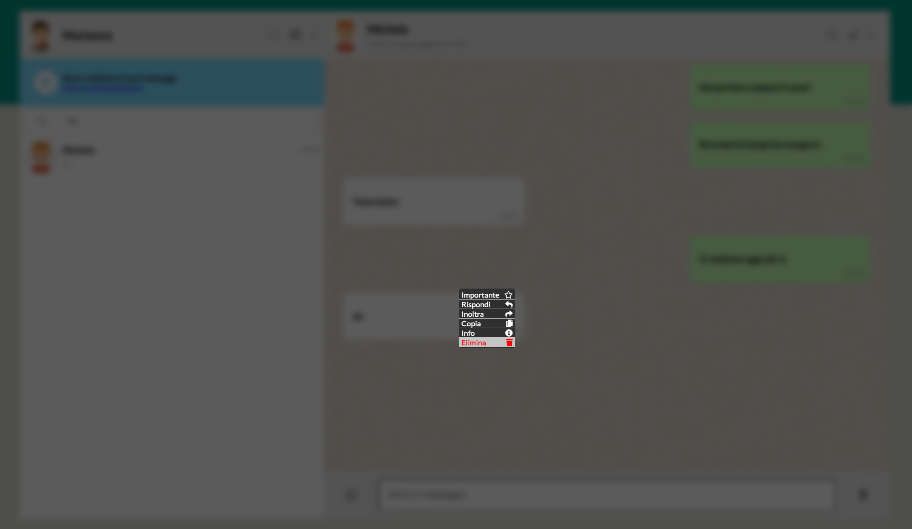

# Replica WhatsApp Web

**Tecnologie utilizzate**
- HTML5
- CSS(flexbox)
- JS
- VueJS
## Possibilità di switchare utente della chat attiva

## Possibilità di ricercare chat

## Possibilità di inviare messaggio,a cui si ottiene risposta dopo 2 secondi( usato settimeout e array di risposte per categoria)

## Possibilità di aprire dropdown per cancellare messaggio
